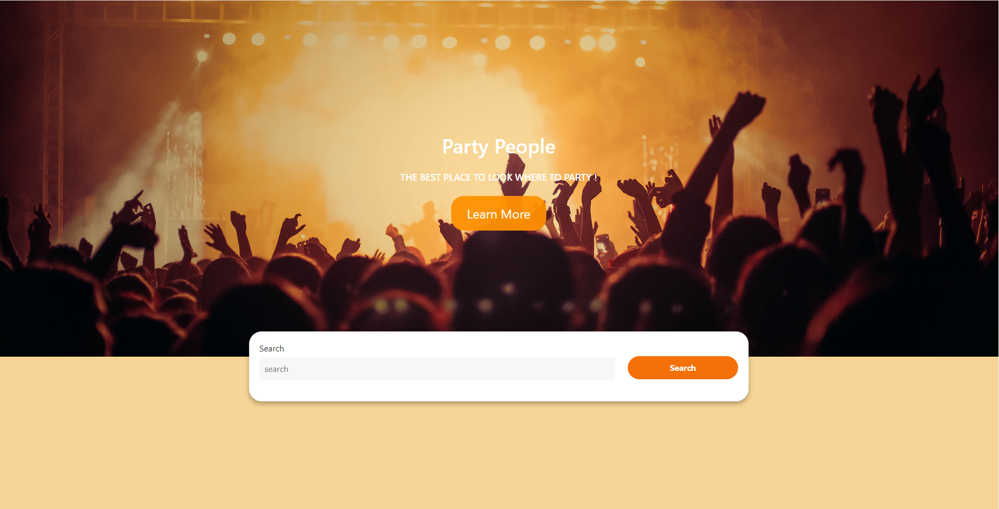

# Party People

Our team created this project so we can find out where our favourite artists will be playing, but also what kind of parties are happening in the cities across the planet.

## Demo

LIVE: https://partypeople.netlify.app/

## Installation

Make sure you have nodejs installed on your computer. After that clone this repository to your computer.

    git clone git@github.com:jemmy344/plan-your-trip.git

Move to your repository

    cd party-people

Make sure you have node modules installed in the same folder before running this program:

    npm install

Once you have installed node modules in repository folder you can run this program with:

    npm start

    
## Usage/Examples

Put your artist name or city into search bar and you will be presented with events. 

## Credits

Jonatan Kwiatkowski, Liam Watson, Jemimah Jacobs, Kohl Vernon
# License

Please refer to the LICENSE in the repo.

